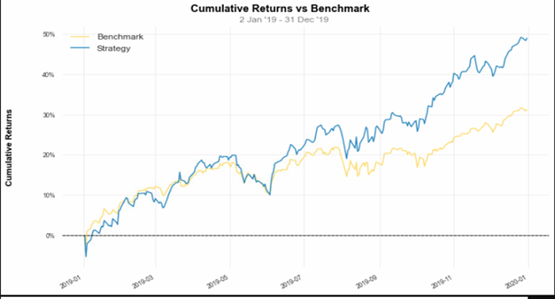

# porflio-optimization-advanced-investment-science
This is the project done in the course Advanced Investment Science. Here I had made two portfolios for a hypothetical client who is teaching English in Korea to pay his college debt. He can do invest of $50K but of which $30K has to be paid as the loan. And from rest $20K, he wants to start a new business after going back to the US. He doesn’t want to take very high risk on the $30K portion but he is okay to take risk in $20K if there is around 6% annual return. One of the portfolios done with Robust Portfolio optimization &amp; I applied algorithmic trading strategies in other. But it was giving less profit than just holding the asset. Therefore, I then decided to continue with holding the portfolio made by markowitz portfolio.

### Used Data Details
        Stocks Used: the dow jones industrial average stocks
        Bonds: 10 years US Treasury Bonds
        Data from 2009 to 2017 were used to make portfolios.
        Data of 2018 were used to test the portfolios
        Investment was done in year 2019.
        Data is collected from yahoo finance. 
        (I ignored data after 2019 data due to the volatile nature of stock for covid 19 situation)

### Overall portfolio Report
        Portfolio 1: 
            Invested = $30000
            Cumulative Return = 31.73 %
            Final = $39519
        Portfolio 2:
            Invested = $20000
            Cumulative Return = 48.99 %
            Final = $29798
        Total Portfolio Value = $69317
        Total Portfolio Growth = 38.63%

## Steps of Optimizing portfolio:

**Calculating daily return & risk:**

- Return was calculated using log return.
- Standard deviation is taken as the risk parameter.

**For the first portfolio, I have used Robust portfolio optimization, as the client wanted an investment with minimal risk.**
 - In portfolio 1, I have added bonds as client wanted it to be least risky. 
 
 **Return Data Frame:**

This is the return data frame & last column is the 10 years US treasury bond.

**Equation of Robust Portfolios under box uncertainity**

**Implementation of Robust Portfolios**

Here is the code been used to do the robust portfolio optimization. Points to be noticed here, in the
robust_opt function there are **two parameters tuner & lambda 0** which are used to **optimize value of
delta & lambda** later. mu, Sigma & delta have been calculated using the functions below,

To optimize the robust portfolio, i.e. finding the optimal value for the tuner & lambda 0 following code
was used,

First, I took values for lamda & tuner to test in the range of 0.1 to 3 with 0.1 difference. Then I ran a loop
using these value & saved the expected return & standard deviation in a pandas data frame.

After that, I sorted the value where we can get the most expected return with least possible standard
deviation. So, I took the 1st row’s value for tuner & lamda shown in the screenshot. That gave following weights for stocks & bonds

After taking the mentioned lambda & tuner, robust optimization almost assigned 99% of the weight in
the stocks. The value was similar almost in every case of the value of lambda & tuner.

To test the portfolio strategy & simulate return for the portfolio, I have used empyrial library. Simulated
return for next 156 days after 2017 December 31st is given below,

Although, by exponential smoothing, prophet, airma & naïveDrift had given negative return but other
methods gave the positive returns. So, I was happy to move forward.

**Investment Report of Portfolio 1:**

Investment was made in 2019 after analyzing the data above, the report of the investment duration
given below,

Very nice thing to notice that, in a year, the portfolio has given the cumulative return of 31.73%!

Here, I took the benchmark as S&P 500, although the portfolio was performing bad in the starting
period, it did better than S&P 500 at the end.

The portfolio gave relatively good return through out the year though in may the return went down to -
4.04%. But next month it caught up & showed the best performance of the year, 7.36%.

Portfolio had to go through the few bad phase as shown in the graph above.

**Portfolio 2:**

For the portfolio 2, I have used Markowitz model to optimize the asset allocation. Note there is no bond
in this portfolio.

This is the code used for Markowitz model, same as robust optimization lambda0 was used to find the
suitable asset location. Mu, Sigma was calculated using the same function as robust optimization
mentioned before. Also same as robust optimization to find the optimal value, I took lambda in same
range & similarly made a data frame in similar sorting order.

From the dataframe, we can see 2 nd & 3rd rows are quite similar. Since my client wanted a better return
from this portfolio, I decided to go forward with the value of lambda as 0.3 as it seems the sweet spot
considering both standard deviation & expected return compared to others.

To simulate the portfolio, I used the historical data because
I wanted to apply algorithmic trading in this portfolio. To be sure if it will be profitable, I needed more
reliable data. In the screenshot empyrial is a function of empyrial library which is used to get the
performance of a strategy in historical data.

The return of portfolio in 2018 is given below,

In 2018, the portfolio gave the cumulative return of 2.71%. Since the return is not that high, it inspired
me more to try if more profit can be achievable by algorithmic trading. Details of the algorithmic trading
strategies used are given below,

I basically used two strategy in algorithmic trading. Making buy & signal using RSI & Simple moving
average crossover, I tried to make the trade. To test the trading strategy I have used backtrading library.
Codes are following, (For all code please check `algorithimic-trading-backtrading_test.py` file)

Here, is the code of RSI. To use backtrader to test the algorithmic trading strategy, we need to use the
object oriented programming. We need to inherit the strategy class of backtrader to the class of RSI. So,
few variables shown in the screenshot are from the strategy class of backtrader. (Whole code is too long
to be shown in screenshot, I will be mentioning the important parts. For all code please check `algorithimic-trading-backtrading_test.py` file) 

These parameters are used in RSI method. Exitbars here means the holding period of an asset.
Maximum 15 days in this strategy, I will be holding any asset before selling it.

RSI was calculated using the window of 10 period. If the rsi is lower than 30, it means the stock is over
sold, the price is going to rise now, so buy signal gets created. And 70 means over bought, price is going
to fall, sell signal creates. Point to be noted that, if there is not signal of sell within 15 days of buying the
stock, we will sell the stock regardless.

**Simple moving average Crossover strategy**

In this strategy, if short moving average & long moving average cross each other we create a buy signal.
Short moving average period is 10 & for long its 50. And if the holding period is more than 10, we exit
the position of holding. For code please check `algorithimic-trading-backtrading_test.py` file.

**Result of Algorithmic Trading:**

**Simple Moving Average Crossover**

After the allocation, I invested the allocated amount using this strategy, after one year of invest time in
2018, it gave negative return.

**RSI Strategy**

Compared to the previous strategy RSI had given worse return. More loss.

**Final Decision for portfolio 2**

As we have seen, in Markowitz model, it had give the return of 2.71% which is significantly higher than
these strategy, So, I changed the decision of using algorithmic trading to use Markowitz alone.

**Investment Report of Portfolio 2**

The report of the investment in the year 2019 given below,

At the year 2019, portfolio 2 had given the cumulative return of 48.99%.

The portfolio outperformed the benchmark S&P 500 by a huge margin.

In June, return was the highest & may has the lowest.

Like the portfolio 1, portfolio 2 also had seen bad phase in may to June along with other 4 top
drawdown period.

**Suggestion For the future:**

Portfolio had seen nice growth in the current investment period, the liability of the client had been well
met. I would suggest the client to stay in the investment plan.

Along with previous plan, we can apply different algorithmic trading techniques with more sophisticated
indicators. As the liability has been met, a certain portion of the portfolio can focus in more risky
measures for better probable returns.
